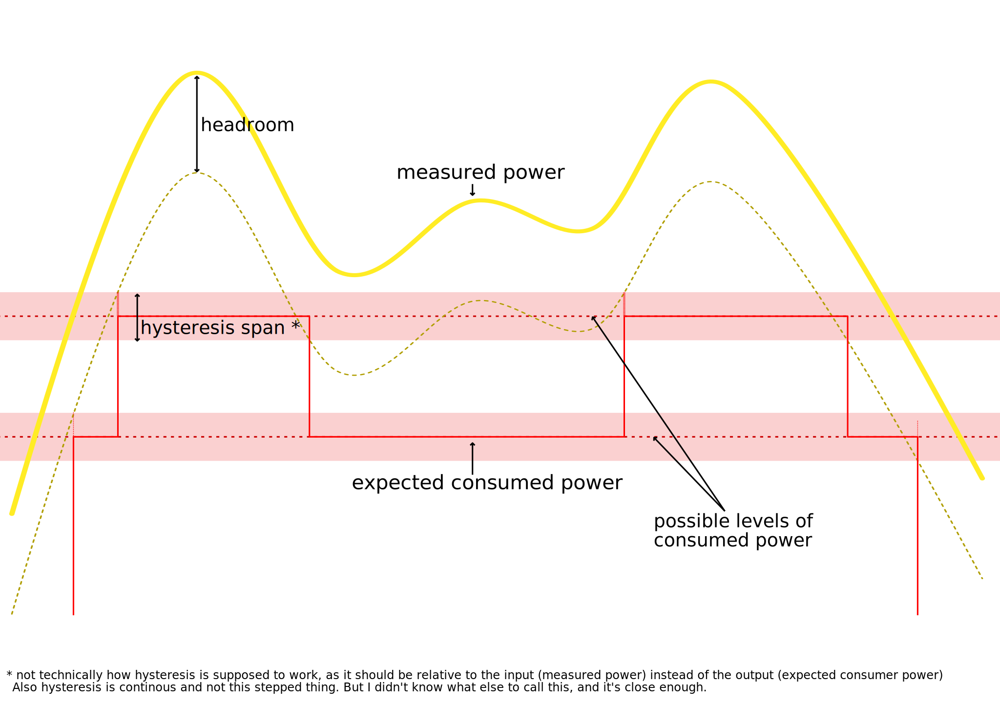

# Load Shedding Script Documentation

load-shedding script will try to turn on/off devices to match the current measured power.
The idea is to install the Shelly in a way it only measures surplus power of a solar panel installation, to turn on/off optional consumers to minimise ingestion into the grid.

This is based on: 
https://github.com/ALLTERCO/shelly-script-examples/blob/main/advanced-load-shedding.js

## Configuration Parameters

| Parameter                          | Description                                                                                                                                                                                                 |
|------------------------------------|-------------------------------------------------------------------------------------------------------------------------------------------------------------------------------------------------------------|
| `power_headroom`                   | The value (in watts) that the script will try to maintain as headroom to avoid drawing from the grid if power readings are fluctuating significantly.                                                       |
| `power_hysteresis_span`            | The difference (in watts) between the lower and upper threshold for changing the state. For example, with `power_hysteresis_span=100` and a current expected power of 2000W, power needs to be under 1950W to step down the consumers. Or with the next possible power draw of 3000W, power needs to be over 3050W to step up the consumers. |
| `power_increase_threshold_duration`| The time (in seconds) that the power has to be above the threshold before turning on a device.                                                                                                              |
| `power_decrease_threshold_duration`| The time (in seconds) that the power has to be below the threshold before turning off a device.                                                                                                             |
| `sync_interval`                    | The time interval (in seconds) between full syncs.                                                                                                                                                          |
| `invert_power_readings`            | A boolean flag indicating whether the power readings are inverted. Just check if the logs of the script report negative values if you produce more than you consume. If not, change this flag.              |

The power-based hysteresis and time based delay are both optional and can be used individually or together.
To better understand them, here are visualisations of them independently.

## TODO

- [ ] Write detailed documentation for each configuration parameter.
- [ ] Add picture for `power_increase_threshold_duration` and `power_decrease_threshold_duration`
- [ ] Actually implement the hysteresis
- [ ] Add configurability over MQTT. At least for simulation power, ideally for all params