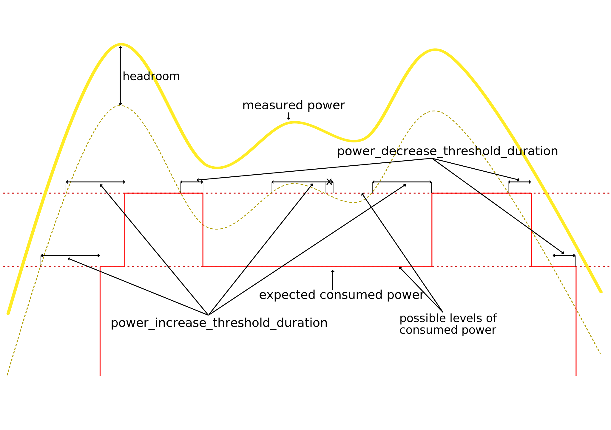

# Load Shedding Script Documentation

load-shedding script will try to turn on/off devices to match the current measured power.
The idea is to install the Shelly in a way it only measures surplus power of a solar panel installation, to turn on/off optional consumers to minimise ingestion into the grid.

This is based on: 
https://github.com/ALLTERCO/shelly-script-examples/blob/main/advanced-load-shedding.js

## Setting up the devices

You have to set up the list of shellys you want to toggle.
For this, look for `const devices = [`.
There are multiple devices predefined to show how this should look like:

```json
{ "name": "1.1", "descr": "Shelly 1 Mini Gen 3", "addr": "192.168.178.49", "gen": 1, "type": "relay", "channel": 0, "expectedPower": 1000 },
```
Every line represents a device. To add or remove devices, simply delete the line or duplicate and edit one.

| Parameter      | Description                                                                       |
|----------------|-----------------------------------------------------------------------------------|
| `name`         | A unique identifier for the device. Pick whatever you want. Will show up in logs. |
| `descr`        | A description of the device. This is for you to take notes and not used anywhere. |
| `addr`         | The IP address of the device. You can look this up in the Shelly app, your router or with an IP scanner. |
| `gen`          | The generation of the Shelly device. This decides which API version to use. See https://shelly-api-docs.shelly.cloud/gen2/Devices/Gen2/ShellyPro1. Or, when in doubt, just test `1`,`2` and `3`. |
| `type`         | The type of device (e.g., `relay`). |
| `channel`      | The channel number to control (for devices with multiple channels, otherwise always `0`). |
| `expectedPower`| The expected power consumption of the device in watts. |


## Configuration Parameters

| Parameter                          | Description                                                                                                                                                                                                 |
|------------------------------------|-------------------------------------------------------------------------------------------------------------------------------------------------------------------------------------------------------------|
| `power_headroom`                   | The value (in watts) that the script will try to maintain as headroom to avoid drawing from the grid if power readings are fluctuating significantly.                                                       |
| `power_hysteresis_span`            | The difference (in watts) between the lower and upper threshold for changing the state. For example, with `power_hysteresis_span=100` and a current expected power of 2000W, power needs to be under 1950W to step down the consumers. Or with the next possible power draw of 3000W, power needs to be over 3050W to step up the consumers. |
| `power_increase_threshold_duration`| The time (in seconds) that the power has to be above the threshold before turning on a device.                                                                                                              |
| `power_decrease_threshold_duration`| The time (in seconds) that the power has to be below the threshold before turning off a device.                                                                                                             |
| `sync_interval`                    | The time interval (in seconds) between full syncs.                                                                                                                                                          |
| `invert_power_readings`            | A boolean flag indicating whether the power readings are inverted. Just check if the logs of the script report negative values if you produce more than you consume. If not, change this flag.              |


The power-based hysteresis and time based delay are both optional and can be used individually or together.
To better understand them, here are visualisations of them independently.





## TODO

- [ ] Write detailed documentation for each configuration parameter.
- [ ] Actually implement the hysteresis
- [ ] Add configurability over MQTT. At least for simulation power, ideally for all params